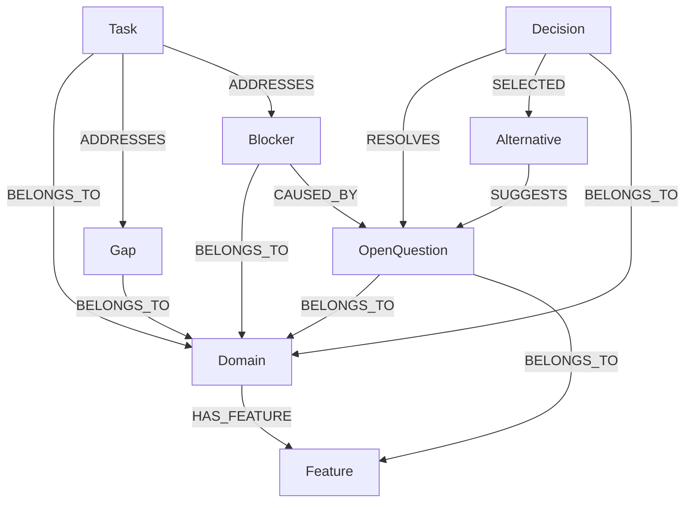

# Waymark Graph Schema Reference

## Naming Conventions

- **Node labels**: PascalCase (e.g., `OpenQuestion`, `Blocker`, `Domain`)
- **Relationship types**: UPPER_SNAKE_CASE (e.g., `RESOLVES`, `BELONGS_TO`, `HAS_FEATURE`)
- **Node IDs**: `<type>:<uuid>` — the type prefix is kebab-case, the UUID is a standard v4 UUID (e.g., `open-question:abc-123`, `decision:def-456`)
- **Semantic edge names** (used in the MCP API): kebab-case (e.g., `resolves`, `belongs-to`, `has-feature`)

---

## Common Properties

All nodes share these base properties:

| Property    | Type     | Required | Description                                      |
|-------------|----------|----------|--------------------------------------------------|
| `id`        | `string` | yes      | `<type>:<uuid>` — globally unique node ID        |
| `type`      | `string` | yes      | Kebab-case node type (e.g., `open-question`)     |
| `title`     | `string` | yes      | Short human-readable title                       |
| `description` | `string` | yes   | Longer description of the node's content         |
| `createdAt` | `string` | yes      | ISO 8601 timestamp                               |
| `updatedAt` | `string` | yes      | ISO 8601 timestamp, updated on every write       |
| `createdBy` | `string` | no       | Identifier for the agent or human who created it |

---

## Node Types

### OpenQuestion

An uncertainty the agent cannot resolve autonomously. The core node type — most Waymark activity starts here.

**Neo4j label**: `OpenQuestion`

| Property    | Type     | Required | Description                                         |
|-------------|----------|----------|-----------------------------------------------------|
| `status`    | `string` | yes      | `open` → `resolved`                                 |
| `urgency`   | `string` | yes      | `low` / `medium` / `high`                           |
| `domainId`  | `string` | no       | ID of the scoping `Domain` node                     |
| `featureId` | `string` | no       | ID of the scoping `Feature` node                    |

**Status lifecycle**:

```
open ──────────────────► resolved
```

Valid transitions: `open → resolved`
Invalid: `resolved → open` (resolutions are permanent; open a new question if needed)

**Typical creator**: Agent

---

### Blocker

A hard dependency or obstacle that prevents forward progress. Unlike an `OpenQuestion`, a blocker is not a question of judgment — it is an external or structural impediment.

**Neo4j label**: `Blocker`

| Property    | Type     | Required | Description                      |
|-------------|----------|----------|----------------------------------|
| `status`    | `string` | yes      | `open` → `unblocked`             |
| `domainId`  | `string` | no       | ID of the scoping `Domain` node  |
| `featureId` | `string` | no       | ID of the scoping `Feature` node |

**Status lifecycle**:

```
open ──────────────────► unblocked
```

Valid transitions: `open → unblocked`
Invalid: `unblocked → open`

**Typical creator**: Agent

---

### Gap

Missing knowledge, specification, or test coverage. QA agents write `Gap` nodes when they find untested paths. Implementation agents write them when a spec is incomplete.

**Neo4j label**: `Gap`

| Property    | Type     | Required | Description                      |
|-------------|----------|----------|----------------------------------|
| `status`    | `string` | yes      | `open` → `closed`                |
| `domainId`  | `string` | no       | ID of the scoping `Domain` node  |
| `featureId` | `string` | no       | ID of the scoping `Feature` node |

**Status lifecycle**:

```
open ──────────────────► closed
```

Valid transitions: `open → closed`

**Typical creator**: Agent or QA Agent

---

### Decision

A resolved choice with rationale. Decisions are written by humans (via `/waymark-resolve`) or occasionally by agents when a clear path is already established. A decision links to the `OpenQuestion` it resolves via a `RESOLVES` edge, and optionally to the `Alternative` it selected via a `SELECTED` edge.

**Neo4j label**: `Decision`

| Property    | Type     | Required | Description                                         |
|-------------|----------|----------|-----------------------------------------------------|
| `status`    | `string` | yes      | `draft` → `accepted` → `deprecated`                 |
| `rationale` | `string` | no       | Explanation of why this decision was made           |
| `domainId`  | `string` | no       | ID of the scoping `Domain` node                     |
| `featureId` | `string` | no       | ID of the scoping `Feature` node                    |

**Status lifecycle**:

```
draft ──────────────────► accepted ──────────────────► deprecated
```

Valid transitions:
- `draft → accepted`
- `accepted → deprecated`

Invalid:
- `deprecated → accepted` (create a new Decision instead)
- `accepted → draft`

**Typical creator**: Human (agent may also create in draft status)

---

### Alternative

A candidate option the agent suggests for an `OpenQuestion`. Agents typically write 1–3 alternatives per question, each with pros and cons. Humans choose among them when writing a `Decision`.

**Neo4j label**: `Alternative`

| Property | Type       | Required | Description                                          |
|----------|------------|----------|------------------------------------------------------|
| `status` | `string`   | yes      | `proposed` → `selected` / `rejected`                 |
| `pros`   | `string[]` | no       | List of advantages                                   |
| `cons`   | `string[]` | no       | List of disadvantages                                |

**Status lifecycle**:

```
proposed ──────────────► selected
         └─────────────► rejected
```

Valid transitions:
- `proposed → selected`
- `proposed → rejected`

Invalid:
- `selected → rejected` or reverse (a selected alternative is final)

**Typical creator**: Agent

---

### Task

A unit of work. Tasks can be created by agents (to track planned work) or humans (to assign follow-up). Tasks can be scoped to a domain or feature and can address a `Gap` or `Blocker` via an `ADDRESSES` edge.

**Neo4j label**: `Task`

| Property     | Type     | Required | Description                                         |
|--------------|----------|----------|-----------------------------------------------------|
| `status`     | `string` | yes      | `open` → `in-progress` → `done` / `cancelled`       |
| `recurrence` | `string` | yes      | `one-time` / `recurring`                            |
| `domainId`   | `string` | no       | ID of the scoping `Domain` node                     |
| `featureId`  | `string` | no       | ID of the scoping `Feature` node                    |

**Status lifecycle**:

```
open ──────────────────► in-progress ──────────────► done
                                     └─────────────► cancelled
open ──────────────────────────────────────────────► cancelled
```

Valid transitions:
- `open → in-progress`
- `open → cancelled`
- `in-progress → done`
- `in-progress → cancelled`

Invalid:
- `done → open` or `done → in-progress` (create a new Task)
- `cancelled → *` (cancelled tasks are terminal)

**Typical creator**: Agent or Human

---

### Domain

A bounded context scoping questions and decisions. Aligns with DDD bounded contexts. Domains have no status — they are persistent organizational nodes.

**Neo4j label**: `Domain`

No status. No additional properties beyond the common set.

**Typical creator**: Human or Agent (during project setup)

---

### Feature

A product feature within a Domain. Provides finer-grained scoping than Domain alone. Features have no status.

**Neo4j label**: `Feature`

No status. No additional properties beyond the common set.

**Typical creator**: Human or Agent (during project setup)

---

## Relationship Types

| Neo4j Rel Type | Semantic (API) | Direction                               | Meaning                                                              | Example                                    |
|----------------|----------------|-----------------------------------------|----------------------------------------------------------------------|--------------------------------------------|
| `RESOLVES`     | `resolves`     | `Decision → OpenQuestion`               | This Decision answers and closes the linked question                 | `dec:123 -[RESOLVES]-> oq:456`             |
| `SUGGESTS`     | `suggests`     | `Alternative → OpenQuestion`            | This Alternative is a candidate answer for the question              | `alt:789 -[SUGGESTS]-> oq:456`             |
| `SELECTED`     | `selected`     | `Decision → Alternative`                | This Decision selected this Alternative as the chosen path           | `dec:123 -[SELECTED]-> alt:789`            |
| `BELONGS_TO`   | `belongs-to`   | `Node → Domain`                         | This node is scoped to this Domain                                   | `oq:456 -[BELONGS_TO]-> dom:001`           |
| `HAS_FEATURE`  | `has-feature`  | `Domain → Feature`                      | This Domain contains this Feature                                    | `dom:001 -[HAS_FEATURE]-> feat:002`        |
| `CAUSED_BY`    | `caused-by`    | `Blocker → Node` or `Node → Node`       | This node was caused by or originates from another node              | `blk:321 -[CAUSED_BY]-> oq:456`           |
| `ADDRESSES`    | `addresses`    | `Task → Gap` or `Task → Blocker`        | This Task is planned work that addresses the linked node             | `tsk:654 -[ADDRESSES]-> gap:987`           |

---

## Full Schema Diagram



---

## Example Cypher Queries

### All open questions

```cypher
MATCH (n:OpenQuestion {status: 'open'})
RETURN n
ORDER BY n.createdAt DESC
```

### All blockers

```cypher
MATCH (n:Blocker {status: 'open'})
RETURN n
ORDER BY n.createdAt DESC
```

### Full trail (last 20 nodes, all types)

```cypher
MATCH (n)
WHERE n.type IN ['open-question','blocker','gap','decision','alternative','task','domain','feature']
RETURN n
ORDER BY n.createdAt DESC
LIMIT 20
```

### All nodes in a specific domain

```cypher
MATCH (n)-[:BELONGS_TO]->(d:Domain {id: $domainId})
RETURN n
ORDER BY n.createdAt DESC
```

### Resolution chain: Decision resolving an OpenQuestion

```cypher
MATCH (d:Decision)-[:RESOLVES]->(q:OpenQuestion {id: $questionId})
RETURN d, q
```

### All alternatives for a specific question

```cypher
MATCH (a:Alternative)-[:SUGGESTS]->(q:OpenQuestion {id: $questionId})
RETURN a
ORDER BY a.status
```

### All nodes created by a specific agent

```cypher
MATCH (n)
WHERE n.createdBy = $agentId
RETURN n
ORDER BY n.createdAt DESC
```

### Nodes by status

```cypher
MATCH (n)
WHERE n.status = $status
RETURN n
ORDER BY n.createdAt DESC
```

### Full alternative selection chain

```cypher
MATCH (d:Decision)-[:RESOLVES]->(q:OpenQuestion {id: $questionId})
MATCH (d)-[:SELECTED]->(a:Alternative)
MATCH (all:Alternative)-[:SUGGESTS]->(q)
RETURN d, q, a AS selected, collect(all) AS allAlternatives
```
