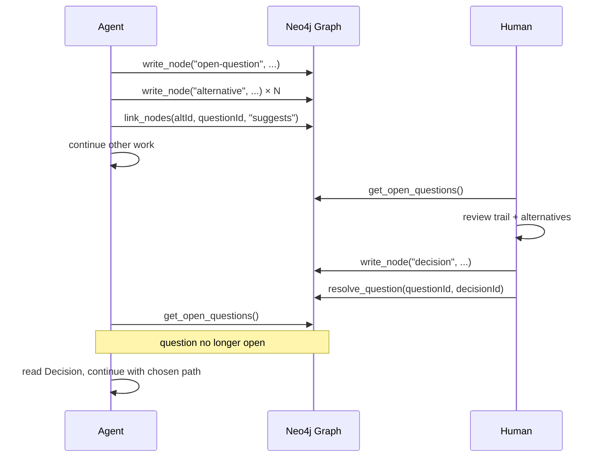
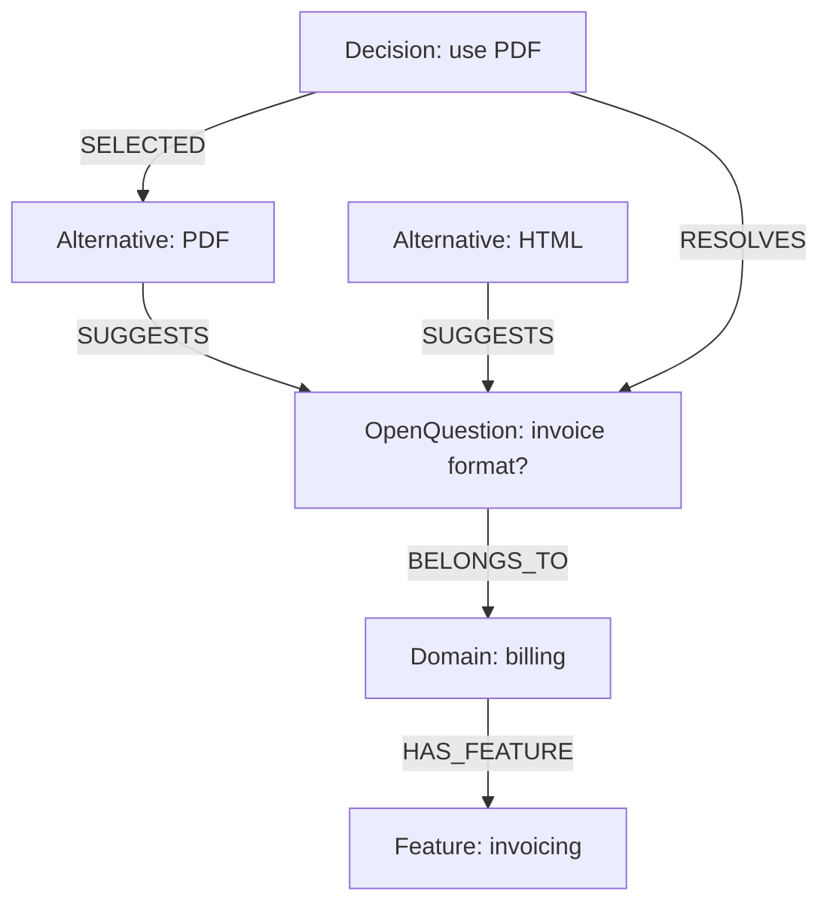

# Waymark Architecture Overview

## Why Waymark Exists

AI agents work silently. When an agent hits uncertainty — a missing requirement, an ambiguous API contract, two valid design paths — it either picks one without logging why, or it stalls. Either way, the reasoning disappears. Logs accumulate, but nobody reads them to reconstruct what the agent was thinking or where it got stuck.

Waymark gives agents a place to leave structured, human-readable traces. Instead of burying uncertainty in log noise, an agent writes a node — an `OpenQuestion`, a `Blocker`, a `Gap` — directly into a Neo4j graph. Humans can review that graph at any time, make decisions, and write those decisions back. The agent reads the updated graph and continues.

The result is an auditable trail: not just what the agent did, but what it was uncertain about, what it considered, and what was decided.

---

## The Two Actors

### Agent (writer)

The agent is the primary writer. It runs tasks, hits uncertainty or ambiguity, and externalizes that uncertainty as a node rather than silently choosing or silently stalling.

- Hits uncertainty → writes an `OpenQuestion` node
- Finds multiple valid paths → attaches `Alternative` nodes with pros and cons
- Encounters a hard dependency that cannot be resolved autonomously → writes a `Blocker`
- Detects missing coverage or knowledge → writes a `Gap`
- Records a completed decision → writes a `Decision` node and links it to the question it answers

The agent does not wait by default. It writes the node, continues where it can, and checks back later by reading the graph.

### Human (reader + decision-maker)

The human reviews the trail the agent has left. This is a read-first interaction: the human reads what the agent wrote, evaluates the alternatives, and writes a `Decision` back into the graph.

- Runs `/waymark` to read the current trail
- Runs `/waymark-resolve` to pick an existing alternative or write a new decision
- The `Decision` node gets linked to the `OpenQuestion`, resolving it
- The agent reads the updated graph on its next cycle and continues with the chosen path

---

## The Write → Review → Decide → Continue Cycle

```
Agent runs
  → hits uncertainty
    → writes OpenQuestion node
      → attaches up to 3 Alternative nodes (agent-suggested options)
        → optionally links to Domain or Feature

Human reviews the graph
  → runs /waymark to read the trail
    → runs /waymark-resolve to pick or write a Decision
      → Decision node linked, OpenQuestion resolved
        → agent reads updated graph and continues
```

This cycle is the core of Waymark. It is not a blocking protocol — the agent writes and moves on. The human reviews asynchronously. When the agent reaches a point where it needs the answer, it checks the graph. If a decision has been written, it proceeds. If not, it can surface the unresolved question again.



---

## Node Types and Their Roles

| Node Type       | Neo4j Label     | Purpose                                                              | Initial Status | Typical Creator |
|-----------------|-----------------|----------------------------------------------------------------------|----------------|-----------------|
| `OpenQuestion`  | `OpenQuestion`  | An uncertainty the agent cannot resolve alone                        | `open`         | Agent           |
| `Blocker`       | `Blocker`       | A hard dependency or obstacle that stops forward progress            | `open`         | Agent           |
| `Gap`           | `Gap`           | Missing knowledge, coverage, or specification                        | `open`         | Agent or QA Agent |
| `Decision`      | `Decision`      | A resolved choice with rationale, resolves an OpenQuestion           | `draft`        | Human (or Agent)|
| `Alternative`   | `Alternative`   | A candidate option suggested for an OpenQuestion                     | `proposed`     | Agent           |
| `Task`          | `Task`          | A unit of work to be done, tracked with status                       | `open`         | Agent or Human  |
| `Domain`        | `Domain`        | A bounded context scoping questions and decisions (DDD alignment)    | —              | Human or Agent  |
| `Feature`       | `Feature`       | A product feature within a Domain, for finer-grained scoping         | —              | Human or Agent  |

---

## Edge Types

Edges are directed. The notation `A → B` means the relationship originates at node A and points to node B.

| Edge (semantic) | Neo4j Rel Type | Direction                           | Meaning                                                      |
|-----------------|----------------|-------------------------------------|--------------------------------------------------------------|
| `resolves`      | `RESOLVES`     | `Decision → OpenQuestion`           | This Decision resolves the linked question                   |
| `suggests`      | `SUGGESTS`     | `Alternative → OpenQuestion`        | This Alternative is a candidate answer to the question       |
| `selected`      | `SELECTED`     | `Decision → Alternative`            | This Decision selected this specific Alternative             |
| `belongs-to`    | `BELONGS_TO`   | `Node → Domain`                     | This node is scoped to this Domain                           |
| `has-feature`   | `HAS_FEATURE`  | `Domain → Feature`                  | This Domain contains this Feature                            |
| `caused-by`     | `CAUSED_BY`    | `Blocker → OpenQuestion` or `Node → Node` | This node was caused by or originates from another node |
| `addresses`     | `ADDRESSES`    | `Task → Gap` or `Task → Blocker`    | This Task is work that addresses the linked node             |

---

## The Trail Metaphor

Nodes accumulate over time. Every `OpenQuestion` the agent writes, every `Alternative` it considered, every `Decision` the human made — all of it stays in the graph. Nothing is overwritten. Nothing is deleted.

The result is a trail: a persistent, queryable record of what the agent encountered, what it considered, and what was chosen. You can query the trail at any point in a project to understand:

- What questions came up during a given feature's development
- Which decisions were made and what the rationale was
- What blockers occurred and whether they were resolved
- What gaps remain open

This makes Waymark useful not just during active agent execution, but after the fact — as a form of structured project memory.

---

## DDD Alignment

Waymark supports Domain-Driven Design through `Domain` and `Feature` nodes. Teams can:

- Create `Domain` nodes representing bounded contexts (e.g., `auth`, `billing`, `notifications`)
- Create `Feature` nodes within those domains
- Scope any `OpenQuestion`, `Blocker`, `Gap`, `Decision`, or `Task` to a specific domain or feature via `domainId` / `featureId` properties and `BELONGS_TO` / `HAS_FEATURE` edges

This allows teams to filter the trail by bounded context — seeing only the questions and decisions relevant to a specific domain, rather than the entire project history.



---

## QA Agents

QA agents participate in the same write-first model. When a QA agent discovers missing test coverage, an untested code path, or a specification gap, it writes a `Gap` node. That gap enters the same trail and can be:

- Reviewed by a human
- Addressed by a `Task` node (linked via `ADDRESSES`)
- Resolved once coverage is added and the gap is closed

This makes QA findings first-class citizens in the project trail, rather than separate reports in a separate system.

---

## Summary

Waymark is not a workflow engine and not a task tracker. It is a write-first communication layer: agents write what they encounter, humans write what they decide, and the graph holds the trail. The protocol is simple — write a node, link it, read it later — and the result is a persistent, queryable record of the reasoning behind a project.
