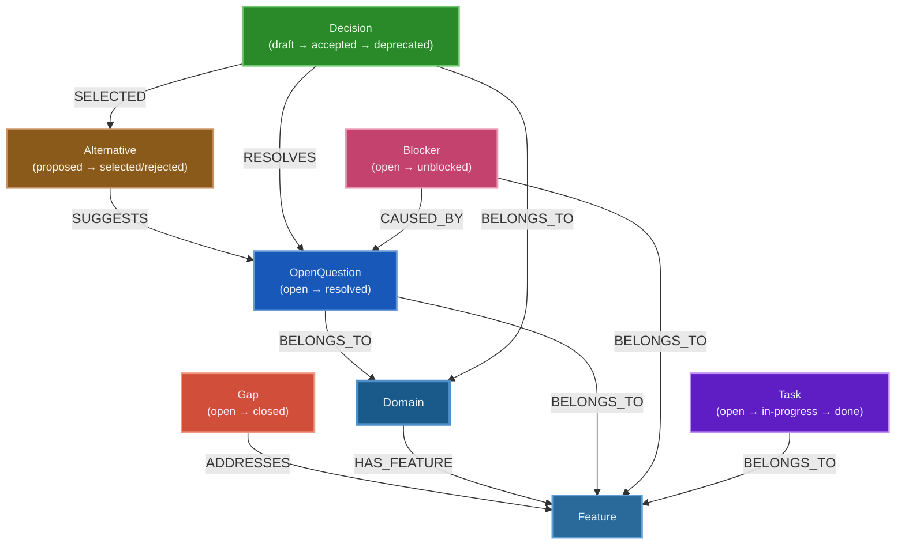

# Graph Architecture

## Overview

Waymark maintains a single Neo4j graph where AI agents write structured traces during execution and humans read them to make decisions. Unlike knowledge-graph systems that rebuild on every run, the Waymark graph is **persistent and append-only**: nodes accumulate across sessions, statuses transition forward, and the history of uncertainty and resolution is preserved.

There are no subgraphs or `kind` separators — every node is a first-class citizen in the same graph. The graph is organized by `Domain` and `Feature` labels that reflect DDD boundaries.

```
Agent runs
  → hits uncertainty
    → writes OpenQuestion node
      → attaches up to 3 Alternative nodes (agent-suggested options)
        → optionally links to Domain or Feature

Human reviews the graph
  → runs /waymark to read the trail
    → runs /waymark-resolve to select or write a Decision
      → Decision linked, OpenQuestion marked resolved
        → agent reads updated graph and continues
```

---

## Node Types

All nodes share a common base of properties. Additional properties are listed per type.

### Common Properties

| Property | Type | Required | Description |
|---|---|---|---|
| `id` | string | ✓ | Unique identifier: `<type>:<uuid>` e.g. `open-question:abc-123` |
| `type` | string | ✓ | One of the 8 node types (kebab-case) |
| `title` | string | ✓ | Short label — one line |
| `description` | string | ✓ | Full explanation |
| `createdAt` | ISO 8601 | ✓ | When the node was created |
| `updatedAt` | ISO 8601 | ✓ | When the node was last modified |
| `createdBy` | string | — | Agent ID or human identifier |
| `domainId` | string | — | Parent domain, if scoped |
| `featureId` | string | — | Parent feature, if scoped |

### OpenQuestion

Something the agent could not resolve. Requires human input before the agent can proceed or choose a path.

| Property | Type | Values |
|---|---|---|
| `status` | string | `open` → `resolved` |
| `urgency` | string | `low` \| `medium` \| `high` |

### Blocker

A hard stop. The agent cannot proceed at all without resolution. More severe than an OpenQuestion.

| Property | Type | Values |
|---|---|---|
| `status` | string | `open` → `unblocked` |

### Gap

A one-time piece of missing context or capability that the agent identified. Created, addressed, and closed. Unlike a Blocker, a Gap does not necessarily stop the agent — it records a known deficiency.

| Property | Type | Values |
|---|---|---|
| `status` | string | `open` → `closed` |

### Decision

A choice made — either by a human (in response to an OpenQuestion) or by an agent (logged for review). Decisions form the resolution backbone of the graph.

| Property | Type | Values |
|---|---|---|
| `status` | string | `draft` → `accepted` → `deprecated` |
| `rationale` | string | Why this choice was made |

### Alternative

A path not taken. Agents attach Alternatives to OpenQuestions to give humans context for choosing.

| Property | Type | Values |
|---|---|---|
| `status` | string | `proposed` → `selected` \| `rejected` |
| `pros` | string[] | Arguments in favour |
| `cons` | string[] | Arguments against |

### Task

Recurring or one-time work the agent identified but did not execute. Intended for agents to pick up later.

| Property | Type | Values |
|---|---|---|
| `status` | string | `open` → `in-progress` → `done` \| `cancelled` |
| `recurrence` | string | `one-time` \| `recurring` |

### Domain

A DDD domain boundary. Groups related OpenQuestions, Decisions, and Features together. Created by humans or agents when structuring the knowledge space.

No status. Contains Features via `HAS_FEATURE`.

### Feature

A named capability within a Domain. Used to scope questions, decisions, and gaps to a specific area of the product.

No status. Must be linked to a Domain via `HAS_FEATURE`.

---

## Status Lifecycles

```
OpenQuestion:  open ──────────────────────► resolved

Blocker:       open ──────────────────────► unblocked

Gap:           open ──────────────────────► closed

Decision:      draft ─────► accepted ──────► deprecated
               draft ──────────────────────► deprecated

Alternative:   proposed ──► selected
               proposed ──► rejected

Task:          open ──► in-progress ──────► done
               open ──► cancelled
               in-progress ──► cancelled
```

Transitions are enforced by the MCP server's `update_status` tool. Backward transitions are rejected.

---

## Relationship Types

| Neo4j type | Semantic name | From | To | Description |
|---|---|---|---|---|
| `RESOLVES` | resolves | Decision | OpenQuestion | Decision answers the question |
| `SUGGESTS` | suggests | Alternative | OpenQuestion | Agent proposes this path |
| `SELECTED` | selected | Decision | Alternative | Human chose this alternative |
| `BELONGS_TO` | belongs-to | Any node | Domain or Feature | Scopes this node to a context |
| `HAS_FEATURE` | has-feature | Domain | Feature | Domain contains a feature |
| `CAUSED_BY` | caused-by | Blocker | OpenQuestion | Blocker stems from this unresolved question |
| `ADDRESSES` | addresses | Gap | Feature | Gap identified in this feature's coverage |

### Naming conventions

Node labels use **PascalCase**: `OpenQuestion`, `Blocker`, `Gap`, `Decision`, `Alternative`, `Task`, `Domain`, `Feature`.

Relationship types use **UPPER_SNAKE_CASE**: `RESOLVES`, `SUGGESTS`, `SELECTED`, `BELONGS_TO`, `HAS_FEATURE`, `CAUSED_BY`, `ADDRESSES`.

Node IDs use **kebab-type:uuid**: `open-question:abc-123`, `decision:def-456`.

---

## Freshness Metadata

Every node carries `createdAt` and `updatedAt` (ISO 8601). These enable:

- **Age-based staleness detection** — find questions open for more than N days
- **Audit trail** — when was this decision made?
- **Prioritization** — surface oldest unresolved items first

The `createdBy` field provides **provenance**: which agent wrote this node, or which human. This is critical for tracing back uncertain decisions to their source.

---

## Graph Diagram



---

## Key Query Patterns

```cypher
// Full trail — last 20 nodes created
MATCH (n) WHERE n.id IS NOT NULL RETURN n ORDER BY n.createdAt DESC LIMIT 20;

// All open questions
MATCH (n:OpenQuestion {status: 'open'}) RETURN n ORDER BY n.createdAt;

// All open blockers
MATCH (n:Blocker {status: 'open'}) RETURN n ORDER BY n.createdAt;

// Resolution chain — what question does this decision answer?
MATCH (d:Decision)-[:RESOLVES]->(q:OpenQuestion) RETURN d, q;

// Alternatives for a question
MATCH (a:Alternative)-[:SUGGESTS]->(q:OpenQuestion {id: $id}) RETURN a;

// All nodes in a domain
MATCH (n {domainId: $domainId}) RETURN n ORDER BY n.type, n.createdAt;

// Unresolved items (open or draft) in a feature
MATCH (n) WHERE n.featureId = $featureId AND n.status IN ['open', 'draft'] RETURN n;

// Nodes created by a specific agent
MATCH (n {createdBy: $agentId}) RETURN n ORDER BY n.createdAt DESC;
```

See [`docs/graph/quality-rules.md`](quality-rules.md) for validation queries and [`docs/graph/outdating-rules.md`](outdating-rules.md) for staleness detection.
