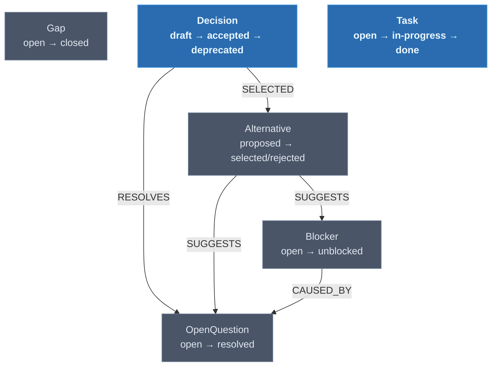

# Graph Architecture

## Overview

Waymark maintains a single persistent Neo4j graph where AI agents write structured traces during execution and humans read them to make decisions. The graph is **append-only**: nodes accumulate across sessions, statuses transition forward, and the history of uncertainty and resolution is preserved.

The graph's primary value is in **Decisions and Tasks** — permanent artifacts that accumulate across all agent sessions and form an authoritative record of what was decided and what remains to be done. Ephemeral nodes (OpenQuestion, Blocker, Gap, Alternative) exist only while unresolved; once addressed, they are excluded from the active trail but remain queryable for audit purposes.

There are no Domain or Feature nodes in Waymark's schema. Those are foreign concerns. The graph is self-contained within the 6 types below.

---

## The Cycle

```
Agent runs
  → hits uncertainty
    → writes OpenQuestion node
      → attaches Alternative nodes (agent-suggested options)

Human reviews the trail
  → runs /waymark to read active nodes
    → writes a Decision (resolving the question)
      → Decision linked via RESOLVES → OpenQuestion archived as resolved
        → Decision stands alone, capturing the full context
          → agent reads updated graph and continues
```

---

## Two Tiers

| Tier | Types | Lifecycle |
|---|---|---|
| Ephemeral (requests) | OpenQuestion, Blocker, Gap, Alternative | Created open/proposed → reach terminal status → excluded from active trail |
| Permanent (artifacts) | Decision, Task | Accumulate indefinitely; never removed from trail |

**Terminal statuses** (excluded from normal queries): `resolved`, `unblocked`, `closed`, `deprecated`, `done`, `cancelled`, `selected`, `rejected`

---

## Node Types

All nodes share a common base of properties. Additional properties are listed per type.

### Common Properties

| Property | Type | Required | Description |
|---|---|---|---|
| `id` | string | yes | Unique identifier: `<type>:<uuid>` e.g. `open-question:abc-123` |
| `type` | string | yes | One of the 6 node types (kebab-case) |
| `title` | string | yes | Short label — one line |
| `description` | string | yes | Full explanation |
| `createdAt` | ISO 8601 | yes | When the node was created |
| `updatedAt` | ISO 8601 | yes | When the node was last modified |
| `createdBy` | string | no | Agent ID or human identifier |
| `status` | string | no | Type-specific; see lifecycles below |

---

### OpenQuestion

Something the agent could not resolve on its own. Requires human input before the agent can proceed or choose a path. Tier: **ephemeral**.

| Property | Type | Values |
|---|---|---|
| `status` | string | `open` → `resolved` |
| `urgency` | string | `low` \| `medium` \| `high` |

---

### Blocker

A hard stop. The agent cannot proceed at all without resolution. Separated into its own label for dashboard priority — blockers surface above open questions in review UIs. Tier: **ephemeral**.

| Property | Type | Values |
|---|---|---|
| `status` | string | `open` → `unblocked` |

---

### Gap

A QA note or piece of missing context identified by the agent. Unlike a Blocker, a Gap does not necessarily stop work — it records a known deficiency for later resolution. Tier: **ephemeral**.

| Property | Type | Values |
|---|---|---|
| `status` | string | `open` → `closed` |

---

### Decision

A choice made — either by a human (in response to an OpenQuestion) or by an agent (logged for review). Decisions are **permanent lasting artifacts** that form the resolution backbone of the graph. They accumulate across sessions and must never be lost. Tier: **permanent**.

| Property | Type | Values |
|---|---|---|
| `status` | string | `draft` → `accepted` → `deprecated` |
| `rationale` | string | Why this choice was made — required at `accepted` |

---

### Alternative

An option proposed by the agent for a specific OpenQuestion or Blocker. Gives the human context for choosing. Tier: **ephemeral**.

| Property | Type | Values |
|---|---|---|
| `status` | string | `proposed` → `selected` \| `rejected` |
| `pros` | string[] | Arguments in favour |
| `cons` | string[] | Arguments against |

---

### Task

Recurring or one-time work identified by the agent. Tasks are **permanent** — they accumulate and persist until explicitly done or cancelled. Intended for agents to pick up in future sessions. Tier: **permanent**.

| Property | Type | Values |
|---|---|---|
| `status` | string | `open` → `in-progress` → `done` \| `cancelled` |
| `recurrence` | string | `one-time` \| `recurring` |

---

## Status Lifecycles

```
OpenQuestion:  open ──────────────────────────────► resolved

Blocker:       open ──────────────────────────────► unblocked

Gap:           open ──────────────────────────────► closed

Decision:      draft ──────► accepted ─────────────► deprecated
               draft ─────────────────────────────► deprecated

Alternative:   proposed ───► selected
               proposed ───► rejected

Task:          open ────────► in-progress ──────────► done
               open ────────────────────────────────► cancelled
               in-progress ────────────────────────► cancelled
```

Transitions are enforced by the MCP server's `update_status` tool. Backward transitions are rejected.

---

## Relationship Types

| Neo4j type | Semantic name | From | To | Description |
|---|---|---|---|---|
| `RESOLVES` | resolves | Decision | OpenQuestion | Decision answers the question |
| `SUGGESTS` | suggests | Alternative | OpenQuestion or Blocker | Agent proposes this path |
| `SELECTED` | selected | Decision | Alternative | Human chose this alternative |
| `CAUSED_BY` | caused-by | Blocker | OpenQuestion | Blocker stems from this unresolved question |

### Naming conventions

Node labels use **PascalCase**: `OpenQuestion`, `Blocker`, `Gap`, `Decision`, `Alternative`, `Task`.

Relationship types use **UPPER_SNAKE_CASE**: `RESOLVES`, `SUGGESTS`, `SELECTED`, `CAUSED_BY`.

Node IDs use **kebab-type:uuid**: `open-question:abc-123`, `decision:def-456`.

---

## Graph Diagram



---

## Key Query Patterns

```cypher
// Active trail (excludes resolved/archived items)
MATCH (n) WHERE n.id IS NOT NULL
AND NOT n.status IN ['resolved','unblocked','closed','deprecated','done','cancelled','selected','rejected']
RETURN n ORDER BY n.createdAt DESC;

// All accepted decisions
MATCH (n:Decision {status: 'accepted'}) RETURN n ORDER BY n.updatedAt DESC;

// All open questions with their alternatives
MATCH (a:Alternative)-[:SUGGESTS]->(q:OpenQuestion {status: 'open'})
RETURN q, collect(a) AS alternatives;

// All open blockers (highest priority)
MATCH (n:Blocker {status: 'open'}) RETURN n ORDER BY n.createdAt;

// Decisions made by a specific agent or human
MATCH (n:Decision {createdBy: $author}) RETURN n ORDER BY n.createdAt DESC;
```

See [`docs/graph/quality-rules.md`](quality-rules.md) for validation queries and [`docs/graph/outdating-rules.md`](outdating-rules.md) for staleness detection.
