# Knowledge Graph — Visual Style Guide

This document defines the visual styling for the Neo4j Browser graph.
Apply it via `:style` in Neo4j Browser — drag `graph-style.grass` onto the panel.

---

## Design Principles

### Size — encodes conceptual importance

| Tier | Nodes | Diameter | Rationale |
|------|-------|----------|-----------|
| 1 | `Domain` | 60px | Root anchor — everything hangs from here |
| 2 | `Feature` | 52px | Primary product unit — clearly dominant over all other nodes |
| 3 | `OpenQuestion` | 40px | Active blockers — important, but subordinate to Feature |
| 3 | `Decision` | 38px | Resolved knowledge — slightly smaller than open questions |
| 4 | `Entity`, `BusinessRule`, `CodeArtifact`, `ViewArtifact` | 34px | Concrete implementation artifacts |
| 4 | `Pitfall`, `Risk`, `Constraint`, `Process`, `Gap` | 30px | Danger and process nodes |
| 5 | `Alternative` | 24px | Supporting context |
| 6 | `Library`, `Pattern` | 20px | Technical primitives |

### Node color — four semantic areas on a dark canvas (`#0F172A`)

All node colors sit at the same perceptual lightness (~50% HSL), so gradients within each area are driven purely by hue — not brightness. Every node reads equally well on the dark background.

**Business Area** — aqua to royal blue (hue 168° → 222°)
The warmest, most human-facing concept (`Domain`) starts at aqua. The spectrum deepens toward royal blue as nodes become more structural and architectural.

`Domain` (BA-1, aqua) → `Feature` (BA-2) → `BusinessRule` (BA-3) → `Decision` (BA-4, royal blue)

**Code Area** — indigo to blue-violet (hue 240° → 258°)
Code nodes are firmly in the indigo-to-violet range with no red component. The area picks up where BA-4 leaves off (~18° hue gap), keeping the two areas visually distinct while still feeling related.

`Library` (CA-1, indigo) → `Entity` (CA-2) → `Pattern` (CA-3) → `Alternative` (CA-4, blue-violet)

**Danger Area** — rose-pink to amber (hue 328° → 46°)
A deliberate ~70° hue jump from CA-4 ensures danger nodes read as a separate semantic category at a glance. The spectrum walks from pink through red into a warm ember glow — each step clearly distinct. DA-4 sits at higher lightness (55%) so it reads visibly brighter than DA-3. DA-5 continues into amber/gold to mark concrete known absences (gaps) as distinct from unresolved questions.

`Risk` (DA-1, rose-pink) → `Pitfall` (DA-2, red) → `Constraint` (DA-3, orange-red) → `OpenQuestion` (DA-4, soft orange-red) → `Gap` (DA-5, amber)

**Implementation Area** — forest green, steel blue, and teal (new)
Implementation nodes sit in a separate hue band (~160° → 210°) clearly distinct from the planning layers. Forest green for code artifacts (things you read/edit), steel blue for processes (things that run), teal for view artefacts (things you look at).

`CodeArtifact` (IA-1, forest green) → `Process` (IA-2, steel blue) → `ViewArtifact` (IA-3, teal)

### Relationship color — mirrors the semantic group

| Group | Relationships | Color | Width |
|-------|--------------|-------|-------|
| **Backbone** | `HAS_FEATURE`, `DEPENDS_ON`, `HAS_RULE` | `#555555` | 2px |
| **Danger** | `HAS_QUESTION`, `AFFECTS`, `CONCERNS`, `SHAPES` | `#B86030` | 1px |
| **Resolution** | `INFORMED_BY`, `PREVENTED_BY`, `MITIGATED_BY`, `EXPLAINS` | `#4A90A8` | 1px |
| **Implementation** | `USES_ENTITY`, `USES_LIBRARY`, `APPLIES_PATTERN`, `FOLLOWS_PATTERN`, `FK_TO`, `IMPLEMENTED_BY`, `VERIFIED_BY`, `CREATED_BY`, `MAPS_TO`, `CALLS`, `ENFORCED_BY` | `#4A7AAE` | 1px |
| **Process** | `RUNS_PROCESS`, `TRIGGERS`, `READS`, `WRITES` | `#3A9A70` | 1px |
| **Decision** | `REJECTED_IN`, `OPTION_FOR` | `#909090` | 1px |

---

## Schema Diagram with Styling

```mermaid
flowchart TD
    %% Business Area BA-1→BA-4 (aqua → royal blue), cool label text
    classDef domain fill:#5E1EC4,stroke:#B478E8,stroke-width:3px,color:#E8EEFF,font-size:16px;
    classDef feature fill:#4833C4,stroke:#A088E8,stroke-width:2px,color:#E8EEFF,font-size:16px;
    classDef rule fill:#3D3DC4,stroke:#9090E8,stroke-width:2px,color:#E8EEFF,font-size:16px;
    classDef decision fill:#2858C0,stroke:#8AAAE0,stroke-width:2px,color:#E8EEFF,font-size:16px;
    %% Code Area CA-1→CA-4 (indigo → blue-violet), cool label text
    classDef library fill:#2C7ED4,stroke:#82BAEA,stroke-width:2px,color:#E8EEFF,font-size:16px;
    classDef entity fill:#2E96B8,stroke:#80CDE8,stroke-width:2px,color:#E8EEFF,font-size:16px;
    classDef pattern fill:#3AA8A8,stroke:#82D8D8,stroke-width:2px,color:#E8EEFF,font-size:16px;
    classDef alternative fill:#3AA898,stroke:#82D8C8,stroke-width:2px,color:#E8EEFF,font-size:16px;
    %% Implementation Area IA-1→IA-3 (forest green + steel blue + teal)
    classDef code fill:#3A9E6A,stroke:#80D0A0,stroke-width:2px,color:#E8EEFF,font-size:16px;
    classDef process fill:#3E9850,stroke:#82C880,stroke-width:2px,color:#E8EEFF,font-size:16px;
    classDef view fill:#489038,stroke:#88C068,stroke-width:2px,color:#E8EEFF,font-size:16px;
    %% Danger Area DA-1→DA-5 (rose-pink → amber), warm label text
    classDef risk fill:#C4426E,stroke:#E898B4,stroke-width:2px,color:#FFE8F2,font-size:16px;
    classDef pitfall fill:#C44250,stroke:#E89898,stroke-width:2px,color:#FFE8F2,font-size:16px;
    classDef constraint fill:#D04E3A,stroke:#F09880,stroke-width:2px,color:#FFE8F2,font-size:16px;
    classDef question fill:#E07838,stroke:#F4B878,stroke-width:2px,color:#FFE8F2,font-size:16px;
    classDef gap fill:#E8A020,stroke:#F4D070,stroke-width:2px,color:#FFF0D0,font-size:16px;

    D(["Domain · 60px"])
    F(["Feature · 52px"])
    ENT(["Entity · 34px"])
    LIB(["Library · 20px"])
    PAT(["Pattern · 20px"])
    DEC(["Decision · 38px"])
    OQ(["OpenQuestion · 40px"])
    ALT(["Alternative · 24px"])
    PIT(["Pitfall · 30px"])
    RSK(["Risk · 30px"])
    CON(["Constraint · 30px"])
    BR(["BusinessRule · 34px"])
    CODE(["CodeArtifact · 34px"])
    PROC(["Process · 30px"])
    VA(["ViewArtifact · 34px"])
    GAP(["Gap · 30px"])

    D -->|HAS_FEATURE| F
    D -->|HAS_QUESTION| OQ
    D -->|INFORMED_BY| DEC
    D -->|DEPENDS_ON| D

    F -->|USES_ENTITY| ENT
    F -->|USES_LIBRARY| LIB
    F -->|APPLIES_PATTERN| PAT
    F -->|DEPENDS_ON| F
    F -->|INFORMED_BY| DEC
    F -->|HAS_QUESTION| OQ
    F -->|HAS_RULE| BR
    F -->|IMPLEMENTED_BY| CODE
    F -->|VERIFIED_BY| CODE
    F -->|RUNS_PROCESS| PROC

    ENT -->|FK_TO| ENT
    ENT -->|FOLLOWS_PATTERN| PAT
    ENT -->|CREATED_BY| CODE

    CODE -->|MAPS_TO| ENT
    CODE -->|CALLS| CODE
    BR -->|ENFORCED_BY| CODE

    PROC -->|TRIGGERS| PROC
    PROC -->|IMPLEMENTED_BY| CODE
    PROC -->|READS| ENT
    PROC -->|WRITES| ENT

    PAT -->|INFORMED_BY| DEC

    ALT -->|OPTION_FOR| OQ
    ALT -->|REJECTED_IN| DEC

    CON -->|SHAPES| F
    CON -->|SHAPES| ENT
    CON -->|SHAPES| PROC
    CON -->|EXPLAINS| DEC

    PIT -->|AFFECTS| F
    PIT -->|AFFECTS| ENT
    PIT -->|AFFECTS| CODE
    PIT -->|AFFECTS| PROC
    PIT -->|PREVENTED_BY| DEC

    RSK -->|CONCERNS| F
    RSK -->|CONCERNS| PROC
    RSK -->|MITIGATED_BY| DEC

    F -->|ILLUSTRATED_BY| VA
    F -->|HAS_GAP| GAP
    VA -->|HAS_GAP| GAP

    class D domain;
    class F feature;
    class ENT entity;
    class LIB library;
    class PAT pattern;
    class DEC decision;
    class OQ question;
    class ALT alternative;
    class PIT pitfall;
    class RSK risk;
    class CON constraint;
    class BR rule;
    class CODE code;
    class PROC process;
    class VA view;
    class GAP gap;
```

---

## Color Reference

### Canvas

| Property | Value |
|----------|-------|
| Background | `#0F172A` |
| Section dividers | `#1E293B` |
| Muted label text | `#94A3B8` |
| Node label text (cool — BA, CA, IA) | `#E8EEFF` |
| Node label text (warm — DA) | `#FFE8F2` |

### Nodes

#### Business Area — aqua to royal blue (hue 168° → 222°)

| ID | Node | Fill | Stroke | Description |
|----|------|------|--------|-------------|
| BA-1 | `Domain` | `#5E1EC4` | `#B478E8` | Aqua — broadest, most human-facing concept |
| BA-2 | `Feature` | `#4833C4` | `#A088E8` | Blue-cyan — primary product unit |
| BA-3 | `BusinessRule` | `#3D3DC4` | `#9090E8` | Cornflower blue — structural rule |
| BA-4 | `Decision` | `#2858C0` | `#8AAAE0` | Royal blue — most architectural node |

#### Code Area — indigo to blue-violet (hue 240° → 258°)

| ID | Node | Fill | Stroke | Description |
|----|------|------|--------|-------------|
| CA-1 | `Library` | `#2C7ED4` | `#82BAEA` | Indigo — external dependency |
| CA-2 | `Entity` | `#2E96B8` | `#80CDE8` | Indigo-violet — domain/storage entity |
| CA-3 | `Pattern` | `#3AA8A8` | `#82D8D8` | Violet — design pattern |
| CA-4 | `Alternative` | `#3AA898` | `#82D8C8` | Blue-violet — rejected path, no red |

#### Implementation Area — forest green and steel blue (new)

| ID | Node | Fill | Stroke | Description |
|----|------|------|--------|-------------|
| IA-1 | `CodeArtifact` | `#3A9E6A` | `#80D0A0` | Forest green — source code class or file |
| IA-2 | `Process` | `#3E9850` | `#82C880` | Steel blue — runtime process or flow |
| IA-3 | `ViewArtifact` | `#489038` | `#88C068` | Teal — design prototype or UI artefact file |

#### Danger Area — rose-pink to amber (hue 328° → 46°)

| ID | Node | Fill | Stroke | Description |
|----|------|------|--------|-------------|
| DA-1 | `Risk` | `#C4426E` | `#E898B4` | Rose-pink — most speculative, most delicate |
| DA-2 | `Pitfall` | `#C44250` | `#E89898` | Red — concrete known bug |
| DA-3 | `Constraint` | `#D04E3A` | `#F09880` | Orange-red — unstated rule |
| DA-4 | `OpenQuestion` | `#E07838` | `#F4B878` | Soft orange-red — most unresolved, visibly brighter |
| DA-5 | `Gap` | `#E8A020` | `#F4D070` | Amber — concrete known absence, identified by review |

### Relationships

| Relationship | Hex | Width | Group |
|-------------|-----|-------|-------|
| `HAS_FEATURE`, `DEPENDS_ON`, `HAS_RULE` | `#555555` | 2px | Backbone |
| `HAS_QUESTION`, `AFFECTS`, `CONCERNS`, `SHAPES` | `#B86030` | 1px | Danger |
| `HAS_GAP` | default | 1px | — |
| `INFORMED_BY`, `PREVENTED_BY`, `MITIGATED_BY`, `EXPLAINS` | `#4A90A8` | 1px | Resolution |
| `USES_ENTITY`, `USES_LIBRARY`, `APPLIES_PATTERN`, `FOLLOWS_PATTERN`, `FK_TO`, `IMPLEMENTED_BY`, `VERIFIED_BY`, `CREATED_BY`, `MAPS_TO`, `CALLS`, `ENFORCED_BY`, `ILLUSTRATED_BY` | `#4A7AAE` | 1px | Implementation |
| `RUNS_PROCESS`, `TRIGGERS`, `READS`, `WRITES` | `#3A9A70` | 1px | Process |
| `REJECTED_IN`, `OPTION_FOR` | `#909090` | 1px | Decision |
